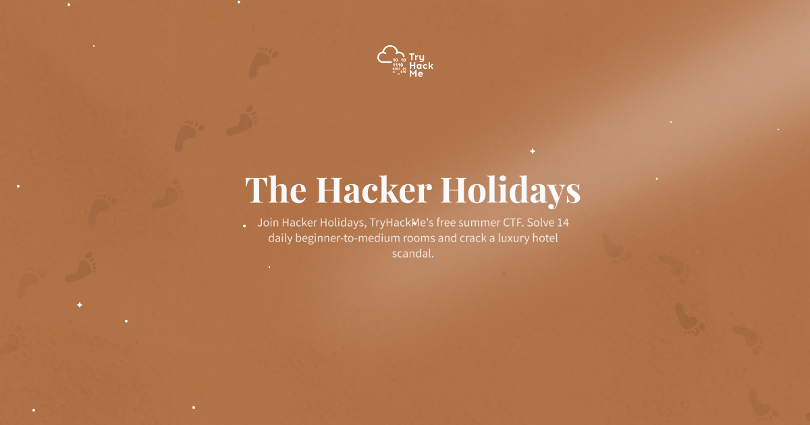
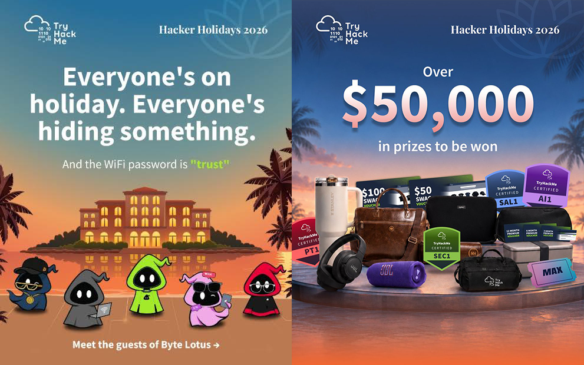

  

**Hacker Holidays 2026** is a free 14-day cybersecurity adventure by [TryHackMe](https://tryhackme.com) that makes learning fun and exciting. Every day, you'll unlock a brand-new hands-on challenge as you explore the fictional Byte Lotus resort. Along the way, you'll discover exciting topics like **OSINT, web security, cloud security, digital forensics, and AI** through interactive, **real world activities**. Whether you're just getting started or already love cybersecurity, there's something new to learn every day. Complete daily challenges, sharpen your practical hacking skills, solve interesting puzzles, and earn raffle entries for the chance to win amazing prizes while enjoying an unforgettable learning experience.

## Event Details
> **Start** : Monday 27th, July 2026  
> **End**   : Monday 10th, August 2026  
> **Level** : Biginner - Expert  
> **Entry** : **FREE**  
> **Visit** : [**Hacker Holiday 2026**](https://tryhackme.com/hackerholidays)  

## Get Started!!
- Register an account on [**TryHackMe**](https://tryhackme.com)
- Then [**Start Today**](https://tryhackme.com/hackerholidays)
- Complete each room and earn **TICKETS**

  

## Prizes Pool🎁

  

## 🏝️ Enjoy the Holiday

>   
> ### DAY 0 : [**The Brochure**](https://tryhackme.com/room/hh-thebrochure-081f3e36)

>   
> ### DAY 1 : [The Concierge Knows Too Much](https://tryhackme.com/room/hh-theconciergeknows-2d7eb4d9)

>   
> ### DAY 2 : [Room 404 (COMING SOON)]()

#

  

